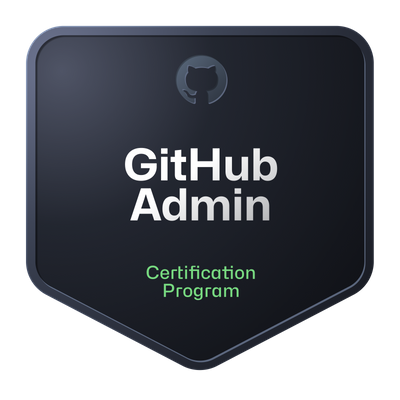
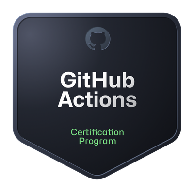
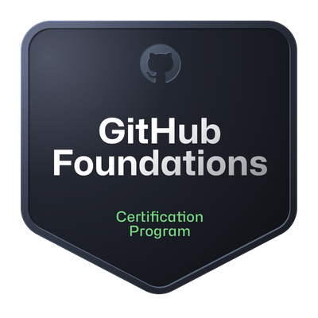
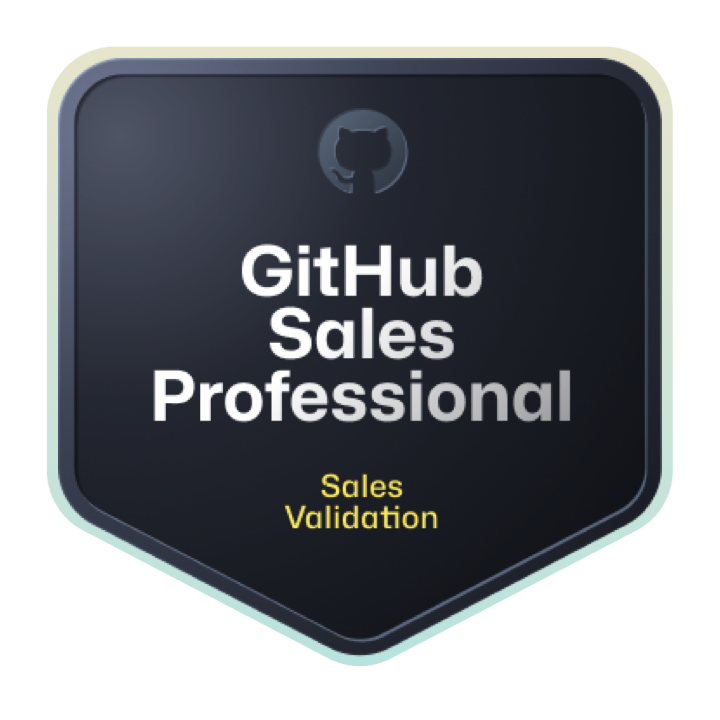

# About me 👋

I'm a passionate DevOps Engineer interested in DevEx and CICD.  
I believe that a great Developer Experience is essential for creating quality code and running efficient organizations.

- 🎓 BSc in Computer Engineering and an MSc in Electrical Engineering
- 👀 I'm interested in DevOps culture, Dev Experience, Automation, and Infrastructure as Code (IaC).
- 🎯 Hobbies including coding, Brazilian jiu-jitsu, DYI, playing video games, dancing, among others 😅
- 🇧🇷 From Brazil - Based in Sweden 🇸🇪
- 🎤 [My Sessionize Profile](https://sessionize.com/renan-alm) 
- 💼 [My LinkedIn Profile](https://www.linkedin.com/in/renan-almeida-93501621/) 
- 📫 How to reach me: [renan-alm@github.com](mailto:renan-alm@github.com) 

# GitHub Certifications

  
  
  
  
  

# My tech stack (Some of it) 

  

